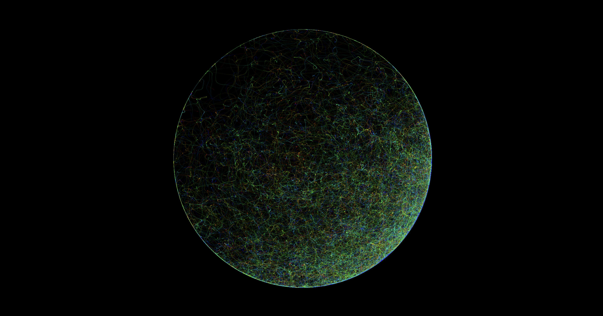

# Limits

Welcome to **As the world rises and falls**, a mesmerizing piece of creative coding art crafted with p5.js!

### Description

**As the World Rises** and Falls is a mesmerizing generative art piece that captures the cyclical flow of existence. This animation visualizes countless nodes tracing intricate paths within a bounded circle, echoing the rhythms of life as they populate and vacate various zones. Each node moves independently, leaving a delicate trail that intertwines with others, forming a dynamic and ever-evolving tapestry of motion. Inspired by the collective movements of living beings, this piece invites viewers to reflect on the continuous rise and fall of interactions that shape our world. Ideal for admirers of abstract art and generative design, this artwork immerses you in a hypnotic dance of light and color, revealing the beauty in our shared journey through time and space.

### Usage

1. Clone the repository to your local machine.

2. Open index.html in a web browser.

3. Watch in awe as the Infinite Vortex mesmerizes you with its hypnotic motion.

### Credits

Inspired by ["As the world rises and falls" by The West Coast Pop Art Experimental Band"](https://open.spotify.com/intl-es/track/6pd2dbPiEX3GALWt42S5wf?si=edc0fa195e9f451f).

### License

This project is licensed under the [MIT License](LICENSE).